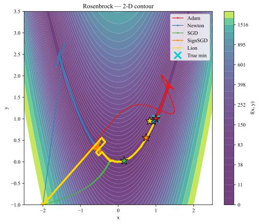
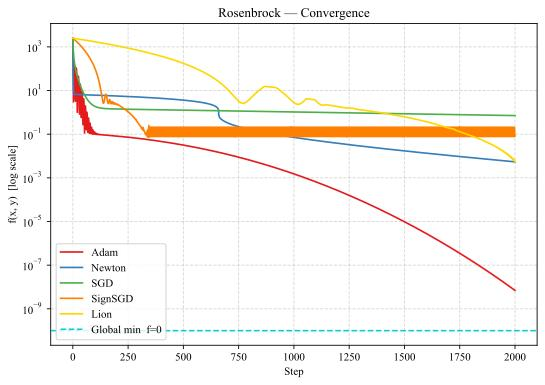
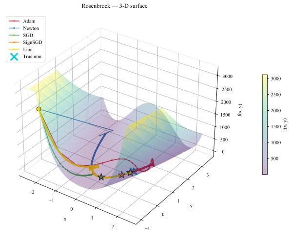

# ZOO Black-Box Adversarial Attack

Implementation of the ZOO (Zeroth Order Optimization) black-box adversarial attack from [Chen et al., 2017](https://arxiv.org/abs/1708.03999), supporting MNIST, CIFAR-10, and ImageNet with multiple coordinate-descent solvers. Forked from the pyTorch implementation following paper's repository.

---

## Installation

```bash
pip install torch torchvision torchsummary numpy matplotlib scikit-image pillow
```

The pre-trained MNIST and CIFAR-10 models are already included in `models/`. The MNIST and CIFAR-10 datasets are downloaded automatically by torchvision on first run, and the ImageNette subset used for ImageNet is fetched automatically when `--dataset imagenet` is selected.

To retrain the classifiers from scratch instead of using the bundled checkpoints:

```bash
python setup_mnist_model.py
python setup_cifar10_model.py
```

---

## Running attacks

### Reproducing the paper results

The results reported in the paper come from sweeping every solver across every model, both untargeted and targeted. A single call runs the whole sweep:

```bash
python run.py # all solvers, all models, both untargeted + targeted, plot generation
```

`run.py` calls the attack below once per (dataset, solver, mode) combination and writes each run's output to its own folder (see [Results](#results)). Restrict the sweep with `--modes untargeted` or `--modes targeted`, narrow it with `--datasets` / `--solvers` / `--samples`, or pass `--dry-run` to preview the commands first.

### Basic usage

```bash
python zoo_l2_attack_black.py --dataset <mnist|cifar10|imagenet> --solver <solver> --samples <n>
```

### All solvers — MNIST

```bash
python zoo_l2_attack_black.py --dataset mnist --solver adam       --samples 10
python zoo_l2_attack_black.py --dataset mnist --solver newton     --samples 10
python zoo_l2_attack_black.py --dataset mnist --solver sgd        --samples 10
python zoo_l2_attack_black.py --dataset mnist --solver sgdsign    --samples 10
python zoo_l2_attack_black.py --dataset mnist --solver signum     --samples 10
python zoo_l2_attack_black.py --dataset mnist --solver lion       --samples 10
python zoo_l2_attack_black.py --dataset mnist --solver adahessian --samples 10
```

### All solvers — CIFAR-10

```bash
python zoo_l2_attack_black.py --dataset cifar10 --solver adam       --samples 10
python zoo_l2_attack_black.py --dataset cifar10 --solver newton     --samples 10
python zoo_l2_attack_black.py --dataset cifar10 --solver sgd        --samples 10
python zoo_l2_attack_black.py --dataset cifar10 --solver sgdsign    --samples 10
python zoo_l2_attack_black.py --dataset cifar10 --solver signum     --samples 10
python zoo_l2_attack_black.py --dataset cifar10 --solver lion       --samples 10
python zoo_l2_attack_black.py --dataset cifar10 --solver adahessian --samples 10
```

### Targeted attack

```bash
python zoo_l2_attack_black.py --dataset mnist   --solver adam --samples 10 --targeted
python zoo_l2_attack_black.py --dataset cifar10 --solver adam --samples 10 --targeted
```

---

## Early stopping

ZOO uses an L2 objective with binary search over the trade-off constant, so by default the attack runs the full iteration budget to minimise distortion. Passing `--early-stop` stops a sample as soon as the adversarial example successfully fools the model, which measures how many queries each solver needs to break the model, a strong indicator of solver efficiency. The number of queries used is saved in `results.json`.

---

## All arguments

| Argument | Default | Description |
|---|---|---|
| `--dataset` | `cifar10` | `mnist`, `cifar10`, or `imagenet` |
| `--solver` | `adam` | `adam`, `newton`, `sgd`, `sgdsign`, `signum`, `lion`, `adahessian` |
| `--samples` | `10` | Number of **source** images. Untargeted: N attacks. Targeted: each source is attacked toward every other class, so for 10-class MNIST/CIFAR-10 that's N × 9 (e.g. 10 → 90 attacks) |
| `--start` | `6` | Offset into the test set |
| `--targeted` | `False` | Targeted attack (default: untargeted) |
| `--targeted-k` | `None` | In targeted mode, use at most K random target classes per source image |
| `--imagenet_dir` | `None` | Path to ImageNet val directory (used when `--dataset imagenet`) |
| `--batch-size` | `128` | Coordinates updated per optimization step |
| `--max-iter` | `1000` | Max iterations per binary-search stage |
| `--const` | `0.01` | Initial attack trade-off constant |
| `--confidence` | `0.0` | CW confidence margin |
| `--early-stop-iters` | `100` | Abort-check cadence |
| `--binary-search-steps` | `9` | Binary search steps over `const` |
| `--adam-beta1` | `0.9` | Optimizer beta1 |
| `--adam-beta2` | `0.999` | Optimizer beta2 |
| `--step-size` | auto | Override the solver's default coordinate step size |
| `--early-stop` | `False` | Stop each sample once the attack succeeds |

Default coordinate step size per solver (override with `--step-size`):

| Solver | step size |
|---|---|
| adam | 0.01 |
| newton | 0.01 |
| sgd | 0.01 |
| sgdsign | 0.015 |
| signum | 0.015 |
| lion | 0.015 |
| adahessian | 0.01 |

---

## Results

Results are saved in `<dataset>/<targeted|untargeted>/<solver>/`:

```
cifar10/
  untargeted/adam/
    results.json               : success rate, queries, distortion, PSNR, SSIM, time
    original_0.png             : original image
    adversarial_0.png          : adversarial image
    grid_cifar10_untargeted_adam.png  : side-by-side grid with class labels
```

`results.json` includes a `queries` block:

```json
"queries": {
  "per_sample": [1200, 800, ...],
  "mean_on_success": 1050.0,
  "budget": 50000
}
```

along with `success_rate_pct`, `total_distortion`, `time_mins`, the per-sample `mse`, `mae`, `psnr`, and `ssim` blocks, and an `attack_params` block recording the hyperparameters used.

---

## Plots

`plot_zoo_metrics_summary.py` reproduces the per-optimizer metric bar chart (MAE, MSE, PSNR, SSIM, L-inf and L2 distortion) for one dataset and threat model. MAE/MSE/PSNR/SSIM are read from each solver's `results.json`; L2 and L-inf are computed from the saved `original_*.png` / `adversarial_*.png` pairs. Folders whose name contains `pgd` are skipped.

```bash
python plot_zoo_metrics_summary.py --dataset cifar10 --attack-type targeted
```

The figure is written to `plots/`. `run.py` renders these charts automatically after the sweep finishes, one per dataset and threat model.


---

## Optimizer intuition

We deliver `opt_visualization.py` for gaining intuition behind the optimizers' behaviour, independent of the attack setting. It minimises classic 2-D test functions — Rosenbrock, Himmelblau, Beale, and Sphere, with the same optimizer family used in the attacks (Adam, Newton, SGD, SignSGD, Signum, Lion), recording each optimizer's trajectory and plotting it over a filled 2-D contour and a 3-D surface, plus a convergence curve.

```bash
python opt_visualization.py
```

Switch the target function, starting point, and per-solver learning rates via the settings at the bottom of the file. A companion script, `grad_est_optimization.py`, runs the same optimizers on the same functions but contrasts exact analytical gradients against finite-difference estimates, so how gradient noise reshapes each optimizer's path can be observed.

Example visualizations:
<p align="center">
  
  
  
</p>

---

## Sample results

Every run writes a labelled grid image (`grid_<dataset>_<mode>_<solver>.png`) into its output folder, showing each source image with its `original → adversarial` prediction. A few precomputed examples are committed under [`sample_results/`](sample_results), so you can see what the attack produces without running anything.

CIFAR-10, Adam (untargeted):

